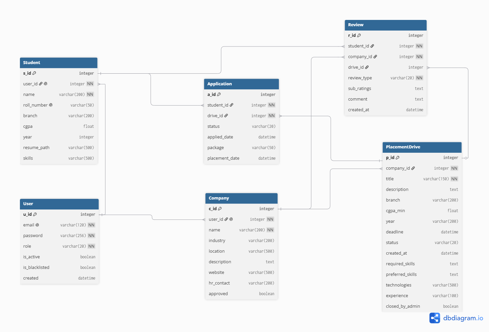

# Placement Portal Application
A web app for managing campus placements built with Flask, Vue.js, SQLite, Redis, and Celery.

## Features
- **Authentication**: JWT‑based login for all roles.
- **Admin**: Manage companies, placement drives, and students, approve/reject registrations and view statistics.
- **Company**: Create and manage placement drives, view applicants, shortlist/select/reject candidates.
- **Student**: View eligible approved drives, apply for drives, track application statuses, edit profile.
- **Validation**: Data validation is done in both client-side (HTML and JavaScript) and server-side (Flask).
- **Security**: Security of the system is ensured using JWT Tokens, password hashing, duplicate prevention, eligibility checks and input sanitization.
- **Background Jobs**: Celery with Redis for daily reminders, monthly reports, and async CSV export.
- **Direct CSV Download**: Students can download their application history as a CSV file directly.
- **Caching**: Redis is used to cache frequent API responses to improve performance. Cache is invalidated on data changes.
- **PWA Support**: The app includes a Web App Manifest and a service worker, making it installable on supported devices.
- **Resume Upload & View**: Students can upload a resume, and companies/admins can view it directly from the applicant list.
- **ATS Check**: A simple keyword‑based resume checker that compares student skills against a drive’s requirements.
- **Ratings**: Students who have been shortlisted can rate the interview process; selected students can rate the company. Ratings are aggregated and displayed to the company without revealing the student's identity.

## Libraries Used
- **Flask**: Web framework for Python.
- **Flask-SQLAlchemy**: ORM for database operations.
- **Werkzeug**: Password hashing and security utilities.
- **Flask-JWT-Extended**: JWT authentication.
- **Flask-Caching** with **Redis** backend for caching API responses.
- **Celery** with **Redis** as broker/backend for asynchronous tasks.
- **Bootstrap 5**: Frontend framework for responsive UI.
- **Vue.js 3**: Reactive frontend framework.
- **Chart.js**: Interactive charts (used in admin analytics).
- **SMTP**: Email sending for notifications, CSV exports, and reports.

## Roles
- **Admin**: Full system access – manage companies, placement drives, students, view analytics and reports, download CSV exports, approve/reject registrations, toggle account active/blacklist status.
- **Company**: After admin approval, can create, edit, close/reopen placement drives, view applicants, shortlist/select/reject candidates, view ratings and reviews for their company.
- **Student**: Can view eligible drives, apply, track applications, edit profile, upload resume, perform ATS skill checks, rate companies and interview processes, and export application history.

## Database
SQLite database (placement.db) with the following relational schema:
- **User**: authentication data (email, hashed password, role), flags is_active and is_blacklisted.
- **Company** : profile details (name, industry, location, website, etc.), linked to User.
- **Student**: personal details (roll number, branch, CGPA, skills, resume), linked to User.
- **PlacementDrive**: drive details (title, description, eligibility, status, required/preferred skills, technologies), closed_by_admin flag to prevent company reopening of admin‑closed drives.
- **Application** : student‑drive mapping with status (applied, shortlisted, selected, rejected), package, placement date.
- **Review**: ratings for companies (culture, compensation, career, etc.) and interview difficulty/process, linked to student and company/drive.
All tables use foreign keys to maintain referential integrity.

## Setup & Use
1. Create virtual environment: `python -m venv venv`
2. Activate it: `venv\Scripts\activate` (Windows) or `source venv/bin/activate` (Mac/Linux)
3. Install dependencies: `pip install -r requirements.txt`
4. Start Redis server: `redis-server`
5. Start Celery worker and Celery Beat: `celery -A app.celery_app worker --loglevel=info --pool=solo`  `celery -A app.celery_app beat --loglevel=info`
6. Run: `python app.py`
7. Open http://localhost:5000 in your browser.
8. Start MailHog: `~/go/bin/MailHog`
9. Access MailHog UI using http://localhost:8025.

## Login Credentials
| Role                 | Email                | Password   |
|----------------------|----------------------|------------|
| Admin                | admin@portal.com     | admin123   |
| Student 1            | student1@portal.com  | pass123    |
| Student 2            | student2@portal.com  | pass123    |
| Student 3            | student3@portal.com  | pass123    |
| Student 4            | student4@portal.com  | pass123    |
| Student 5            | student5@portal.com  | pass123    |
| Student 6            | student6@portal.com  | pass123    |
| Student 7            | student7@portal.com  | pass123    |
| Student 8            | student8@portal.com  | pass123    |
| Student 9            | student9@portal.com  | pass123    |
| Student 10           | student10@portal.com | pass123    |
| Student 11           | student11@portal.com | pass123    |
| Student 12           | student12@portal.com | pass123    |
| TechNova Solutions   | hr1@portal.com       | pass123    |
| AnalyticsHub         | hr2@portal.com       | pass123    |
| CloudPeak Systems    | hr3@portal.com       | pass123    |
| FinEdge Technologies | hr4@portal.com       | pass123    |
| GreenEnergy Corp     | hr5@portal.com       | pass123    |
| MediCare Innovations | hr6@portal.com       | pass123    |
| EduTech Global       | hr7@portal.com       | pass123    |
| AutoDrive Motors     | hr8@portal.com       | pass123    |

## References
1. Flask Web Development 2nd Edition - Miguel Grinberg
2. Learning Web Design 5th Edition - Jennifer Niederst Robbins
3. Database System Concepts 7th Edition - Abraham Silberschatz, Henry F. Korth, S. Sudarshan
4. Eloquent Javascript: A Modern Introduction to Programming 4th Edition - Marijn Haverbeke
5. You Don’t Know JS: Up and Going - Kyle Simpson
6. You Don’t Know JS: Types and Grammar - Kyle Simpson
7. You Don’t Know JS: ES6 and Beyond - Kyle Simpson
8. You Don’t Know JS: Async and Performance - Kyle Simpson
9. You Don’t Know JS: this and Object Prototypes - Kyle Simpson
10. You Don’t Know JS: Scope and Closures - Kyle Simpson
11. The Jamstack Book: Beyond Static Sites With Javascript, APIs, and Markup - Raymond Camden, Brian Rinaldi
12. Vue.js 3 for Beginners: Learn the essentials of Vue.js 3 and its ecosystem to build modern web applications - Simone Cuomo

## Online Resources Used
1. https://coolors.co/ (Colour Palette)
2. https://getbootstrap.com/docs/5.0/getting-started/introduction/ (Bootstrap Documentation)
3. https://www.w3schools.com/bootstrap5/index.php (Bootstrap Tutorial)
4. https://flask.palletsprojects.com/en/stable/ (Flask Documentation)
5. https://flask-sqlalchemy.readthedocs.io/en/stable/ (Flask-SQLAlchemy Documentation)
6. https://werkzeug.palletsprojects.com/en/stable/ (Werkzeug Documentation)
7. https://vuejs.org/guide/introduction (Vue.js Documentation)
8. https://docs.celeryq.dev/en/stable/ (Celery Documentation)
9. https://flask-jwt-extended.readthedocs.io/en/stable/ (Flask-JWT-Extended Documentation)
10. https://storyset.com/ (Website Illustrations)
